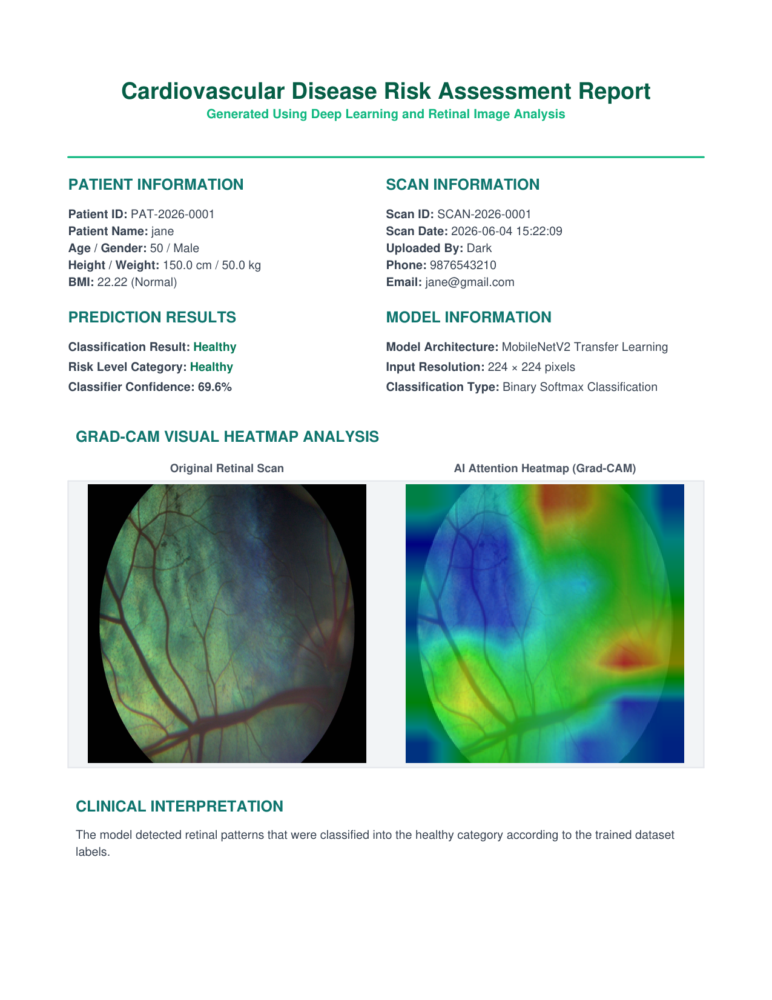

# Prediction of Cardiovascular Disease Using Retinal Image Classification with Deep Learning

A production-quality academic demonstration project designed to predict cardiovascular disease (CVD) risk from retinal fundus images using deep learning transfer learning models. Built with a React (Vite + Tailwind CSS) frontend and a FastAPI (SQLite + SQLAlchemy) backend.

> [!IMPORTANT]
> This is an academic demonstration project and should not be used as a source for medical diagnosis or clinical advice.

---

## Key Features

- **Real Machine Learning Pipeline**: 
  - Trained using a MobileNetV2 Transfer Learning architecture on real cattle retinal fundus images.
  - Features stratified data splitting (70% train, 15% validation, 15% test).
  - Employs **Early Stopping** and **Model Checkpointing** to save the best model epoch weight configurations.
  
- **Secure Authentication & Access Levels**:
  - Requires Full Name, Email, and strong password validation (min 8 characters, 1 uppercase, 1 lowercase, 1 number, 1 special character).
  - Interactive password strength checklist during signup and password change.
  - Automatic Admin promotion for the first registered user.
  - Interactive CLI Admin Creation Script (`create_admin.py`).

- **Secure Password Reset**:
  - Full end-to-end token-based password reset using secure JWT tokens.

- **Interactive Health Analytics Dashboard**:
  - Real-time scan metrics (Total, Healthy, Risk Cases, Avg. Confidence).
  - Line-chart trend visualization of predictions over time using Chart.js.
  - View details of the latest scan findings.

- **History & Admin Control Panel**:
  - Full paginated table of scan history records with search functionality.
  - Admin view exposing global platform database metrics, registered user lists, prediction audit logs, and account/scan deletion controls.

- **Clinical PDF Report Generation**:
  - Automatically compiles patient demographics, ML prediction metrics, and risk assessment level.
  - Features side-by-side visualization of the original retinal fundus image and the explainable AI **Grad-CAM heatmap** showing region-of-interest focus.
  - Fully formatted, downloadable, and printable PDFs generated server-side using ReportLab.

  <p align="center">
    
  </p>

---

## Tech Stack

| Layer | Technology |
|---|---|
| **Frontend** | React 18, Vite, Tailwind CSS, Axios, React Router v6, Chart.js, Lucide Icons |
| **Backend** | FastAPI, SQLAlchemy, Uvicorn, SQLite, Python-Jose (JWT), Bcrypt, Email-Validator |
| **AI / ML** | TensorFlow 2.16+, Keras, MobileNetV2, Pillow (PIL), NumPy 1.26.4 |

---

## Project Structure

```text
cvd-retina-ai/
├── backend/
│   ├── app.py                # FastAPI main application endpoints
│   ├── auth.py               # Password hashing & JWT token verification helpers
│   ├── database.py           # SQLAlchemy database configuration
│   ├── models.py             # Database tables (User, Prediction)
│   ├── schemas.py            # Pydantic schemas with timezone-aware datetime serialization
│   ├── predict.py            # TensorFlow inference engine using trained weights
│   ├── explainability.py     # Grad-CAM heatmap visualization generator
│   ├── report_generator.py   # PDF medical report generator (ReportLab integration)
│   ├── create_admin.py       # Secure interactive CLI admin creation script
│   ├── requirements.txt      # Python dependencies
│   └── models/
│       └── model.h5          # Best trained MobileNetV2 weights file (loaded on demand)
├── frontend/
│   ├── src/
│   │   ├── components/       # Reusable UI (Navbar, Footer, ProtectedRoute, AdminRoute)
│   │   ├── context/          # React Auth Context API
│   │   ├── pages/            # Page components (Home, Login, Register, Dashboard, Scan, Profile, Admin)
│   │   └── services/         # Axios API connection client
│   ├── tailwind.config.js    # Tailwind layout settings
│   └── package.json          # Node dependencies
├── training/
│   ├── preprocess.py         # Stratified dataset downloader, copier & resizer (224x224 RGB)
│   └── train.py              # MobileNetV2 transfer learning model training script
└── dataset/                  # Initialized upon running training/preprocess.py
```

---

## Setup & Running Guide

### 1. Prerequisites
- Python 3.12 or newer.
- Node.js (v18+) & npm.

### 2. Set Up Virtual Environment & Dependencies
1. Open your terminal in the root directory.
2. **Create and Activate Virtual Environment**:
   Using `uv` (recommended):
   ```bash
   # Create virtual environment
   uv venv

   # Activate virtual environment:
   # On Windows (PowerShell):
   .venv\Scripts\activate
   # On Windows (CMD):
   .venv\Scripts\activate.bat
   # On Unix/macOS:
   source .venv/bin/activate
   ```
   *Alternatively, using standard python: `python -m venv .venv`*

3. **Install Dependencies**:
   Using `uv` (recommended, near-instant):
   ```bash
   uv pip install -r backend/requirements.txt
   ```
   *Alternatively, using standard pip: `pip install -r backend/requirements.txt`*

### 3. Preprocess & Train the Model (Optional)
*A pre-trained model is already saved in the repository at `backend/models/model.h5`. If you wish to retrain the model on the real dataset, ensure your virtual environment is activated and run:*

1. Preprocess the dataset (download, partition, and resize to 224x224 RGB):
   ```bash
   python training/preprocess.py
   ```
2. Train the model weights:
   ```bash
   python training/train.py
   ```
   *(Training uses Early Stopping; the best model weights will automatically be saved to `backend/models/model.h5`).*

### 4. Run the FastAPI Backend
1. Ensure your virtual environment is activated.
2. Navigate to the backend folder:
   ```bash
   cd backend
   ```
3. Configure environment variables:
   Copy the example environment template file and customize it:
   ```bash
   cp .env.example .env
   ```
   *(Note: Make sure to change the `SECRET_KEY` in `.env` to a secure custom string in production).*
4. Launch the development server:
   ```bash
   python -m uvicorn app:app --reload --host 127.0.0.1 --port 8000
   ```
   *(The API will be available at `http://127.0.0.1:8000`).*

### 5. Create an Admin User (Optional CLI)
To create an administrator account directly via CLI (rather than web signup):
1. Navigate to the backend folder and run:
   ```bash
   python create_admin.py
   ```
2. Enter the Full Name, Email, and Password when prompted.

### 6. Run the React Frontend
1. Open a new terminal and navigate to the frontend folder:
   ```bash
   cd frontend
   ```
2. Install Node modules:
   ```bash
   npm install
   ```
3. Start the dev server:
   ```bash
   npm run dev
   ```
4. Open your browser and navigate to:
   ```text
   http://localhost:5173
   ```

---

## Core API Endpoints

### Public Routes
- `GET /health` - Service status check.
- `POST /auth/register` - Create user account (First registered user becomes Admin).
- `POST /auth/login` - Authenticate credentials and return JWT bearer token.
- `POST /auth/forgot-password` - Generate password reset token (logs to backend console).
- `POST /auth/reset-password` - Reset password using validation token.

### User Protected Routes
- `GET /auth/me` - Retrieve profile of current logged-in user.
- `PUT /auth/profile` - Update user Full Name, Username, and Email.
- `PUT /auth/change-password` - Change account password.
- `POST /predict` - Upload retinal fundus image (.jpg/.png) and receive classification prediction.
- `GET /history` - List history scans of logged-in user.
- `GET /dashboard` - Fetch personal stats, confidence trends, and recent history.

### Admin Protected Routes
- `GET /admin/users` - Global user list and scan counts.
- `DELETE /admin/users/{user_id}` - Delete user account and associated history records.
- `GET /admin/predictions` - Global scan log audits.
- `DELETE /admin/predictions/{pred_id}` - Delete specific scan audit record.

### Temporary Debug Routes
- `GET /debug/database` - Inspect database status, table lists, record counts, and latest entries.
- `GET /debug/patients` - Retrieve all registered patient records.
- `GET /debug/predictions` - Retrieve all prediction scan logs.

---

## Database Schema (SQLite)

### 1. `users` Table
Stores registered platform users/clinicians.
- `id` (INTEGER, Primary Key, Autoincrement)
- `full_name` (VARCHAR, Not Null)
- `username` (VARCHAR, Not Null)
- `email` (VARCHAR, Unique, Not Null)
- `password_hash` (VARCHAR, Not Null)
- `role` (VARCHAR, Default 'user', Not Null)
- `created_at` (DATETIME, Default UTC Now, Not Null)

### 2. `patients` Table
Stores patient demographic and physical screening details.
- `id` (INTEGER, Primary Key, Autoincrement)
- `patient_id` (VARCHAR, Unique, Not Null) - E.g., `PAT-2026-0001`
- `full_name` (VARCHAR, Not Null)
- `age` (INTEGER, Not Null)
- `gender` (VARCHAR, Not Null)
- `phone` (VARCHAR, Not Null)
- `email` (VARCHAR, Not Null)
- `height` (FLOAT, Not Null)
- `weight` (FLOAT, Not Null)
- `bmi` (FLOAT, Not Null)
- `bmi_category` (VARCHAR, Not Null)
- `notes` (VARCHAR, Nullable)
- `created_at` (DATETIME, Default UTC Now, Not Null)
- `updated_at` (DATETIME, Default UTC Now, Not Null)

### 3. `predictions` Table
Stores AI scan inferences and Grad-CAM/PDF report paths, linked to patients.
- `id` (INTEGER, Primary Key, Autoincrement)
- `scan_id` (VARCHAR, Unique) - E.g., `SCAN-2026-0001`
- `patient_id` (INTEGER, ForeignKey to `patients.id`, On Delete CASCADE, Not Null)
- `user_id` (INTEGER, ForeignKey to `users.id`, On Delete CASCADE, Not Null)
- `image_name` (VARCHAR, Not Null)
- `image_path` (VARCHAR, Nullable)
- `prediction` (VARCHAR, Not Null) - e.g., `Healthy` or `Cardiovascular Disease Risk`
- `predicted_class` (VARCHAR, Nullable)
- `risk_level` (VARCHAR, Nullable)
- `confidence` (FLOAT, Not Null)
- `status` (VARCHAR, Default 'Pending', Nullable)
- `gradcam_image` (VARCHAR, Nullable)
- `report_path` (VARCHAR, Nullable)
- `scan_date` (DATETIME, Default UTC Now, Nullable)
- `timestamp` (DATETIME, Default UTC Now, Not Null)
- `created_at` (DATETIME, Default UTC Now, Nullable)
